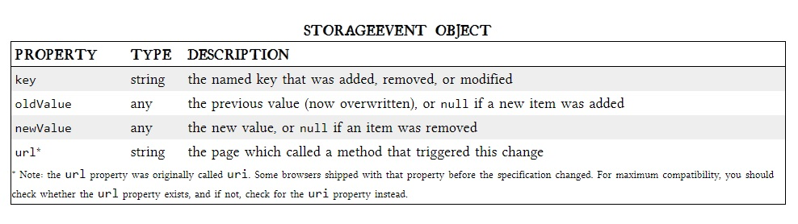

# Local Storage

## HTML5 Storage
is based on named key/value pairs. You store data based on a named key, then you can retrieve that data with the same key. The named key is a string. The data can be any type supported by JavaScript, including strings, Booleans, integers, or floats. However, the data is actually stored as a string. If you are storing and retrieving anything other than strings, you will need to use functions like parseInt() or parseFloat() to coerce your retrieved data into the expected JavaScript datatype.   

## what does local storage mean?
Local storage is the process of storing digital data on physical storage devices, such as hard disc drives (HDDs), solid state drives (SSDs), or external storage devices, such as thumb drives or discs.

## What is the use of local storage?
local Storage is a new JavaScript API in HTML5 that allows us to save data in key/value pairs in a user's browser. It's a little bit like cookies except: Cookies expire and get cleared a lot, local Storage is forever (until explicitly cleared).

# StorageEvent Object
A StorageEvent is sent to a window when a storage area it has access to is changed within the context of another document.
