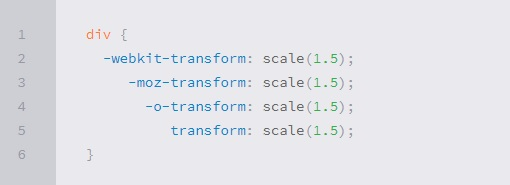
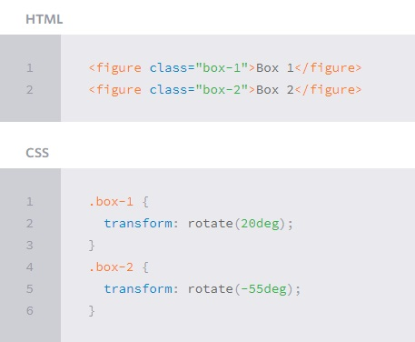
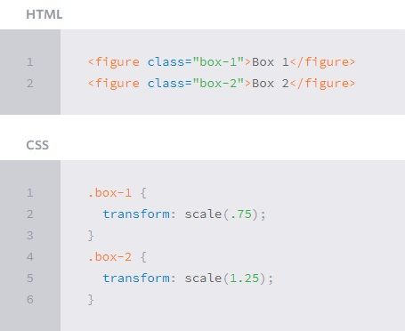
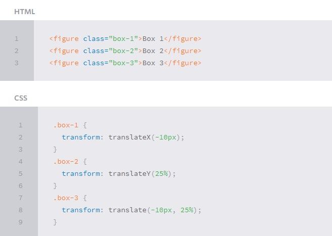
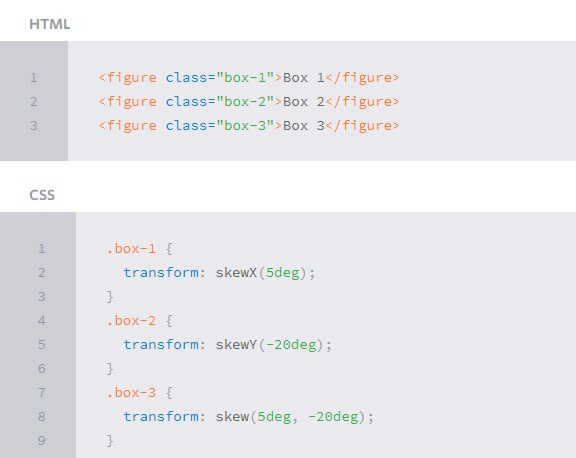

# CSS Transforms, Transitions, and Animations
## CSS Transforms

* Definition :   
The transform property applies a 2D or 3D transformation to an element. This property allows you to rotate, scale, move, skew, etc., elements. 

* Transform Syntax   
The actual syntax for the transform property is quite simple, including the transform property followed by the value. The value specifies the transform type followed by a specific amount inside parentheses.

Elements may be distorted, or transformed, on both a two-dimensional plane or a three-dimensional plane. Two-dimensional transforms work on the x and y axes, known as horizontal and vertical axes. Three-dimensional transforms work on both the x and y axes, as well as the z axis. These three-dimensional transforms help define not only the length and width of an element, but also the depth.
.
* 2D Rotate   
The rotate() CSS function defines a transformation that rotates an element around a fixed point on the 2D plane, without deforming it.

* 2D Scale   
The scale() CSS function defines a transformation that resizes an element on the 2D plane. Because the amount of scaling is defined by a vector, it can resize the horizontal and vertical dimensions at different scales.

* 2D Translate   
The translate() method moves an element from its current position (according to the parameters given for the X-axis and the Y-axis).

* 2D Skew   
The last transform value in the group, skew, is used to distort elements on the horizontal axis, vertical axis, or both. The syntax is very similar to that of the scale and translate values. Using the skewX value distorts an element on the horizontal axis while the skewY value distorts an element on the vertical axis.

## Does 3D transform perspective property have z axis view?
Three dimensional transforms add the ability to manipulate objects along the z axis (or in the z direction). As with 2D transforms, 3D transforms are set using the transform property. Its value must be one or more functions and their arguments.
## Transitions & Animations

Transitions in CSS are applied to an element and specify that when a property changes it should do so over gradually over over a period of time. Animations are different. When applied, they just run and do their thing. They offer more fine-grained control as you can control different stops of the animations.

##  CSS Transitions 

CSS transitions allows you to change property values smoothly, over a given duration.
## Transition properties:   
1. transition.
2. transition-delay.
3. transition-duration.
4. transition-property.
5. transition-timing-function.
## How to Use CSS Transitions?
To create a transition effect, you must specify two things :   
1. The CSS property you want to add an effect to.
2. The duration of the effect.

## CSS Animations 
 
CSS allows animation of HTML elements without using JavaScript or Flash.
## Animation properties:
1. @keyframes .
2. animation-name .
3. animation-duration .
4. animation-delay .
5. animation-iteration-count .
6. animation-direction .
7. animation-timing-function .
8. animation-fill-mode .
9. animation .

## What are CSS Animations?
* An animation lets an element gradually change from one style to another.
* You can change as many CSS properties you want, as many times you want.
* To use CSS animation, you must first specify some keyframes for the animation.
* Keyframes hold what styles the element will have at certain times.
* When you specify CSS styles inside the @keyframes rule, the animation will gradually change from the current style to the new style at certain times.
* To get an animation to work, you must bind the animation to an element.
